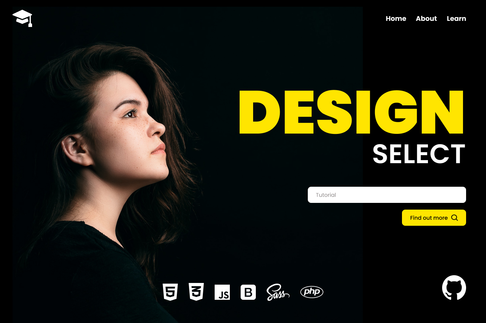

# Design Select

## About The Project

This educational Landing Page was designed to appeal to young web developers. It is a place where a community of like minded people can learn, teach and discuss web technologies such as HTML5, CSS3, JavaScript, PHP, Bootstrap and SASS. Built using Bootstrap, this responsive fictional Landing Page was designed in Figma before being built using VS Code.

## Built With

* Bootstrap5

## License

Distributed under the MIT License. See `LICENSE.txt` for more information.

## Contact
1. Shane Kenzler <shanekenzler@gmail.com>

## Acknowledgments

* [Github](https://github.com)
* [Figma](https://www.figma.com)
* [VS Code](https://code.visualstudio.com)
