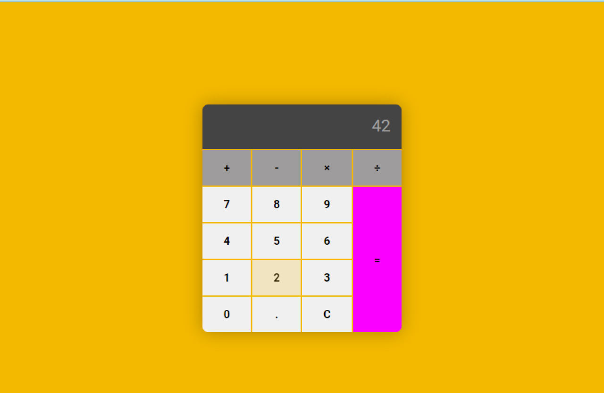

# JS Calculator

## About The Project

A simple calculator built using JavaScript

## Built With

* HTML5
* CSS3
* JavaScript

## License

Distributed under the MIT License. See `LICENSE.txt` for more information.

## Contact
1. Shane Kenzler <shanekenzler@gmail.com>

## Acknowledgments

* [Github](https://github.com)
* [VS Code](https://code.visualstudio.com)
